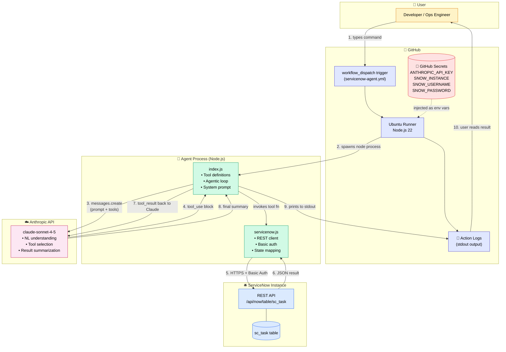
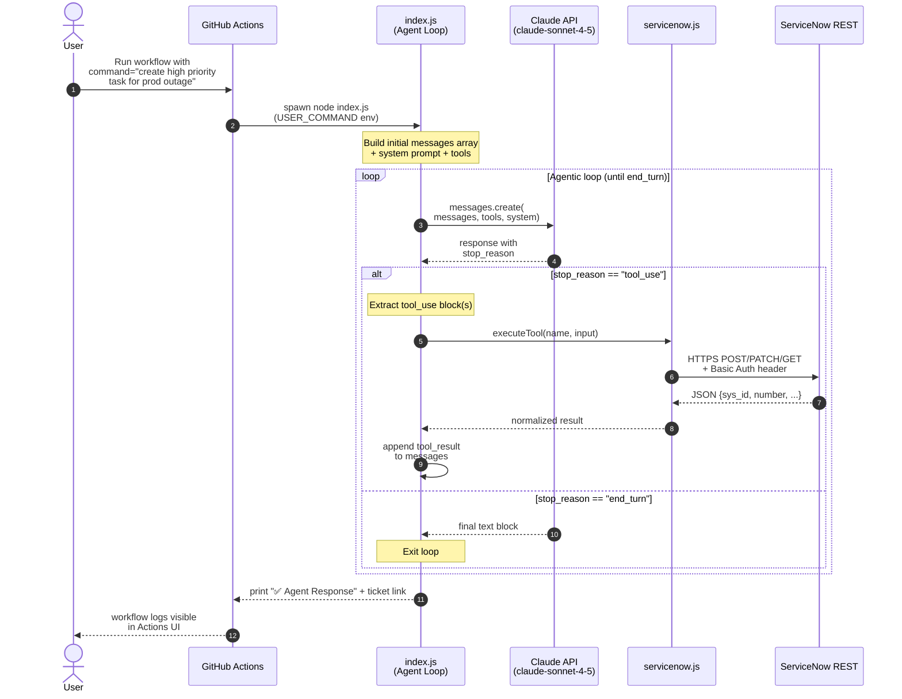
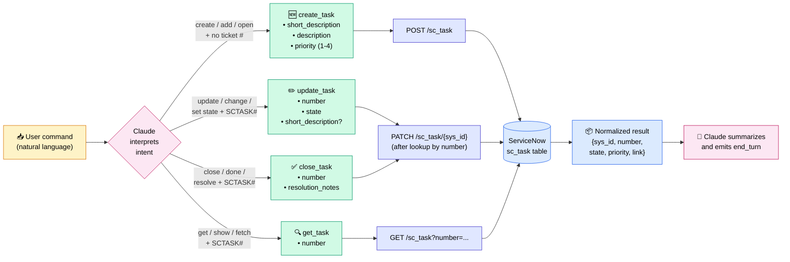
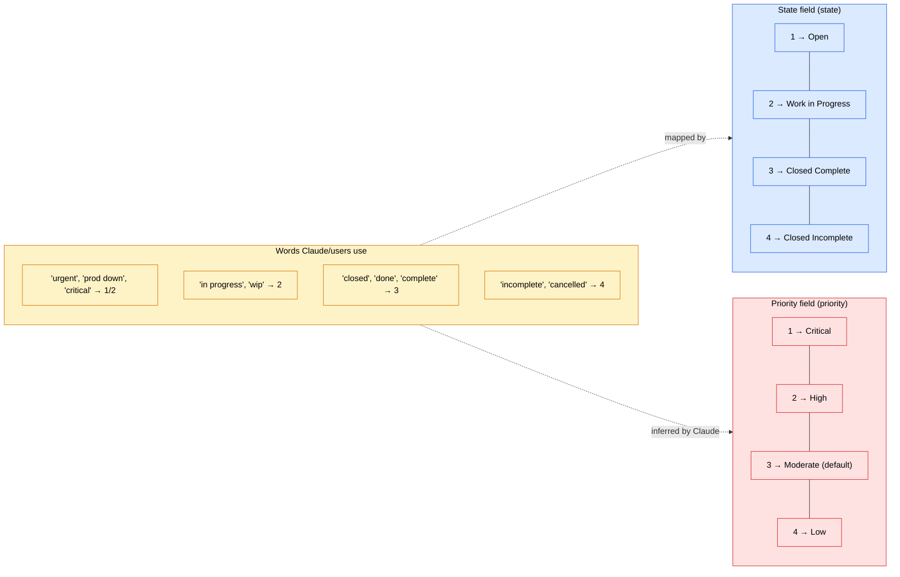
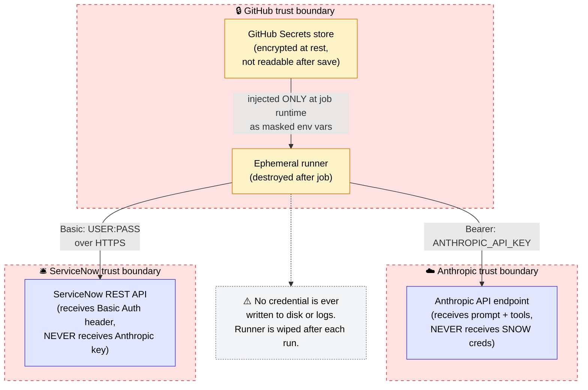

# 🤖 ServiceNow Agent — Powered by Google Gemini

> A POC | Built with Google Gemini + GitHub Actions + ServiceNow REST API

This agent lets you manage ServiceNow tasks using plain English commands. No UI needed — just type what you want and the AI does it.

---

## 💡 What problem does it solve?

Normally to create or update a ServiceNow task you have to:
1. Log into ServiceNow
2. Navigate to the right module
3. Fill in multiple fields manually
4. Save and copy the ticket number

With this agent you just type:
```
create a high priority task for production bug fix in payment service
```
And the agent creates the ticket, fills all fields intelligently, and gives you the ticket number and link — in seconds.

---

## 🎯 What it can do

| You type | Agent does |
|---|---|
| `create a task for deployment review` | Creates SCTASK with Moderate priority |
| `create a high priority task for prod outage` | Creates SCTASK with High priority |
| `create a critical task for server is down` | Creates SCTASK with Critical priority |
| `update SCTASK0010001 to in progress` | Updates ticket state |
| `close SCTASK0010001 work is done` | Closes the ticket |
| `get details of SCTASK0010001` | Fetches ticket info |

---

## 🏗️ Architecture

```
You type a command in GitHub Actions
            ↓
    GitHub Actions starts a Linux runner
            ↓
    Node.js runs the agent (index.js)
            ↓
    Gemini reads your command
    and decides which tool to call
            ↓
    ┌─────────────────────────────┐
    │  create_task  update_task   │
    │  close_task   get_task      │
    └─────────────────────────────┘
            ↓
    servicenow.js calls the
    ServiceNow REST API
            ↓
    Ticket created/updated in ServiceNow
            ↓
    Gemini summarizes: "Done! SCTASK0010001 created"
            ↓
    You see the result in GitHub Actions logs
```

---

## 📁 Project structure

```
servicenow-agent/
├── .github/
│   └── workflows/
│       └── servicenow-agent.yml   ← GitHub Actions trigger + pipeline
├── agent/
│   ├── index.js                   ← Gemini agent brain + agentic loop
│   ├── servicenow.js              ← ServiceNow REST API client
│   └── package.json               ← Node.js dependencies
├── .gitignore
└── README.md
```

### File responsibilities

**`servicenow-agent.yml`** — the trigger. Defines when and how the workflow runs. Uses `workflow_dispatch` so you manually trigger it with a text input. Passes your secrets securely as environment variables.

**`agent/index.js`** — the brain. Sends your command to Gemini, runs the agentic loop (Gemini → tool call → ServiceNow result → Gemini summarizes), and prints the final result.

**`agent/servicenow.js`** — the hands. Makes authenticated HTTP calls to the ServiceNow REST API to create, update, close, or fetch tasks.

---

## 🔑 Key concepts

### Agentic loop
The core of the POC. Instead of a simple one-shot API call, Gemini runs in a loop:
1. Read your command
2. Decide which tool to call (`create_task`, `update_task` etc.)
3. Call ServiceNow API
4. Read the result
5. Summarize and respond
6. Stop when done

This is what makes it an **agent** — not just a script.

### Tool use (function calling)
Gemini doesn't directly call APIs. Instead we define **tools** (like a menu of actions) and Gemini decides which one to use based on your natural language input. Gemini fills in all the required fields intelligently — priority, description, state — from context.

### Secrets management
API keys and passwords are stored as **GitHub Secrets** — never in code. The workflow injects them as environment variables at runtime. Even repo admins can't read them after saving.

---

## ⚙️ Setup for your team

### Prerequisites
- GitHub account with a repo
- ServiceNow developer instance (free at developer.servicenow.com)
- Google Gemini API key (from aistudio.google.com — free tier available)
- Node.js 20+

### Step 1 — Clone the repo
```bash
git clone https://github.com/mohinimishra/servicenow-agent.git
cd servicenow-agent
```

### Step 2 — Add GitHub Secrets
Go to **Settings → Secrets and variables → Actions → New repository secret**

| Secret | Value |
|---|---|
| `GEMINI_API_KEY` | Your key from aistudio.google.com |
| `SNOW_INSTANCE` | e.g. `dev12345.service-now.com` |
| `SNOW_USERNAME` | `admin` |
| `SNOW_PASSWORD` | Your ServiceNow admin password |

### Step 3 — Run the agent
1. Go to **Actions** tab in your repo
2. Click **ServiceNow Agent** in the sidebar
3. Click **Run workflow**
4. Type your command e.g. `create a task for testing the agent`
5. Click **Run workflow**
6. Watch the logs — ticket number and link appear in ~30 seconds

### Step 4 — Run locally (optional)
```bash
cd agent
npm install

SNOW_INSTANCE=dev12345.service-now.com \
SNOW_USERNAME=admin \
SNOW_PASSWORD=yourpassword \
GEMINI_API_KEY=your-gemini-key \
USER_COMMAND="create a task for deployment review" \
node index.js
```

---

## 🗺️ Priority mapping

| Value | Priority |
|---|---|
| 1 | Critical |
| 2 | High |
| 3 | Moderate (default) |
| 4 | Low |

Gemini infers priority automatically from context — "urgent", "prod down", "critical" → High/Critical. Regular tasks → Moderate.

## 📊 State mapping

| Value | State |
|---|---|
| 1 | Open |
| 2 | Work in Progress |
| 3 | Closed Complete |
| 4 | Closed Incomplete |

---

## 🚀 Future enhancements

- [ ] Connect to GitHub Issues — auto-create ServiceNow task when issue is opened
- [ ] Slack integration — type commands in Slack, agent updates ServiceNow
- [ ] Multi-ticket support — handle multiple tickets in one command
- [ ] Priority escalation — auto-escalate tasks based on SLA breach
- [ ] Notification on ticket update — email/Slack alert when task status changes

---

## 🛠️ Tech stack

| Technology | Purpose |
|---|---|
| Google Gemini 2.5 Flash | AI brain — natural language understanding + tool use |
| GitHub Actions | CI/CD pipeline + manual workflow trigger |
| Node.js 20 | Runtime for the agent |
| ServiceNow REST API | Ticket management (sc_task table) |
| @google/genai | Gemini API client |


---

## 🧭 Detailed Architecture (Mermaid)

### 1. System component diagram

End-to-end view of every actor, secret store, and external system involved when a command is executed.



---

### 2. Agentic loop — sequence diagram

How a single command flows turn-by-turn through Claude's tool-use loop until the model emits `end_turn`.



---

### 3. Tool selection decision flow

How Claude picks one of the four tools based on the natural-language command.



---

### 4. State & priority mapping (data view)

Reference for the magic numbers ServiceNow uses on the `sc_task` table — these are what `servicenow.js` translates user-friendly words into.



---

### 5. Secrets & trust boundaries

Where each credential lives, who can read it, and how it crosses trust boundaries at runtime.



---

### How to read these diagrams

- **Diagram 1** answers *"what are all the moving parts?"* — use it to onboard new teammates.
- **Diagram 2** answers *"what happens in time?"* — use it to debug an agent run that misbehaves.
- **Diagram 3** answers *"why did Claude pick this tool?"* — use it when adding a new tool.
- **Diagram 4** answers *"what do these numbers mean in ServiceNow?"* — use it when extending state/priority handling.
- **Diagram 5** answers *"is this secure?"* — use it for any security review or audit conversation.

> 💡 GitHub renders Mermaid natively in Markdown — no extra setup needed. To edit, paste any block into [mermaid.live](https://mermaid.live).


